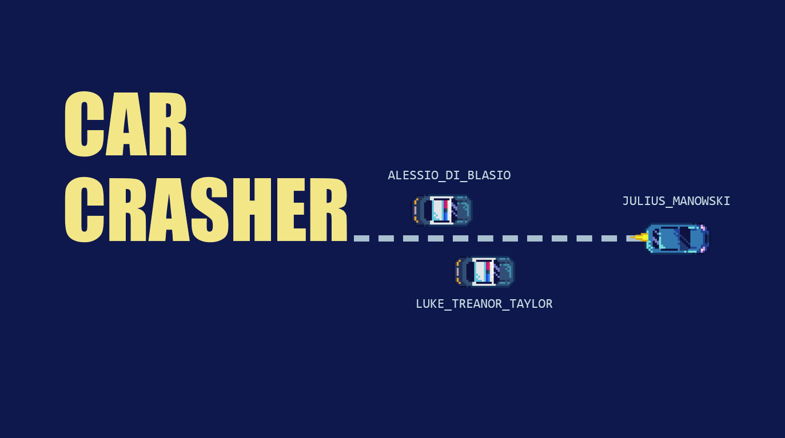

Car Crasher is a fast-paced 2D car dodging game built with C++ and SFML. 
Test your reflexes as you navigate through challenging obstacles and switch lanes to avoid crashes!

---

## 🚗 Features
- Smooth lane-switching mechanics.
- Simple yet challenging, suitable for quick gaming sessions.

---

## 🎮 How to Play
1. Use the arrow keys to switch lanes.
2. Avoid hitting obstacles while maintaining control of your car.
3. Try to survive as long as you can!

---

## 📥 Download the Game
The latest release of Car Crasher can be downloaded from the [Releases page](https://github.com/jules946/set09121_games_engineering_car_crasher/releases).

---

## 📹 Gameplay Video
<!-- Replace "link-to-video" with the actual video URL -->
[Watch the gameplay video here](https://vimeo.com/1038347969)

---

## 🛠️ Requirements
- Windows 10 or higher.
- No additional dependencies (all runtime files are included in the installer).

---

## 💡 Development
Car Crasher was developed for the Edinrbugh Napier University Games Engineering Module using:
- **C++**
- **SFML** for graphics and audio
- **CMake** for build configuration

